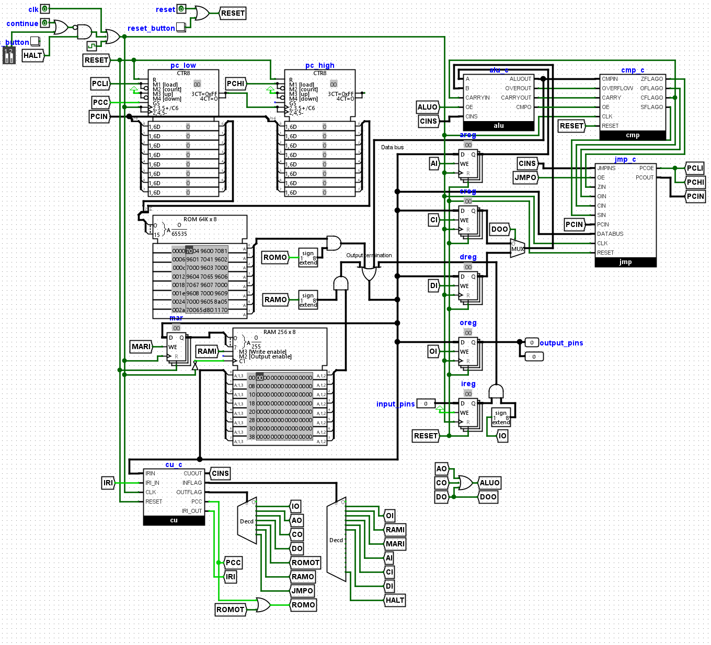

# Overview

This project is an 8-bit computer I originally designed in Logisim Evolution, which I am now porting to TinyTapeout for manufacturing. 

Below is the general architecture of the computer, shown in Logisim Evolution. However, some modifications were made to ensure compatibility with VHDL and TinyTapeout.



The most notable change is the addition of a B register, as well as adjustments to enable ROM and RAM communication via SPI. Detailed information on these changes is provided below.

# Testing the Computer

The computer doesn't have any start signal and will begin read from the SPI ROM as soon as the clock signal (`clk`) starts ticking.

For examples of programs and a basic assembler, please see this repository (https://github.com/AeroX2/tt06-jrb8-computer/). \
Clone the repository and use the assembler with the following command:

```bash
python3 ./example_programs/assembler.py
```

A file dialog will open, allowing you to select a `*.j` file.

## Sample Program: 8-bit Fibonacci Sequence

Below is a simple 8-bit Fibonacci program in the custom `J` format (`fibonacci.j`):

```assembly
:start
load rom a 1
load rom b 0
:repeat
mov a c
opp a+b
jmp < start
out a
mov c b
jmp >= repeat
```

This program, when assembled, translates to the following hexadecimal format:

```hex
d0 01 d1 00 02 6c 33 00 00 f4 08 36 00 04
```

For a comprehensive guide on assembler instructions and their corresponding hex codes, refer to this document (https://docs.google.com/document/d/1ZVZw_Kt-KQHER0Wr5ty7JpUEeox_284Mih4rwE16FVM/edit?usp=sharing).\
You can also look at `roms/cu_flags.csv` in the `tt06-jrb8-computer` repository

The input register or the `i` register is mapped to `ui_in`\
The output register or the `o` register is mapped to `uo_out`

## Memory Mapping

To load data into the ROM, place it at offset 0. The address space is divided as follows:

- **ROM (Program Data):** 0x0000 to 0xFFFF
- **RAM:** 0x10000 to 0x1FFFF

### RAM Addressing

RAM addressing is handled through two registers:

- **`mpage` Register:** Controls `0x1**00`
- **`mar` Register:** Controls `0x100**`

# External Hardware Requirements

External SPI storage is required for this computer, with mappings compatible with spi-ram-emu (https://github.com/MichaelBell/spi-ram-emu/). The following `uio` mappings are used:

```yaml
uio[0]: "cs rom"
uio[1]: "mosi"
uio[2]: "miso"
uio[3]: "sck"
```
